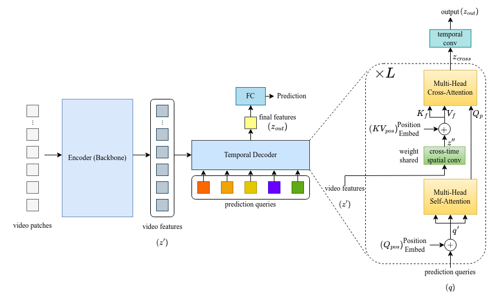

# EfficientTemporalDecoder
This is implementaion of paper "An Efficient Temporal Decoding Module for Action Recognition".

<div align="center">
  
</div>


## Installation
* PyTorch >= 1.7
* torchvision
* einops
* opencv


## Quick Start

### Training
1. In this code we use [TokShift-Transformer](https://arxiv.org/abs/2108.02432) as an encoder to extract video frame features and download the pre-trained weights for the Kinetics-400 dataset from [best_tokshift_B16x32x224_k400.pth](https://drive.google.com/drive/folders/1w2XrDRLNJdDG1e6OczsxKEr6-LuwhVgv?usp=sharing).
1. Download HMDB51 dataset from [here](https://serre-lab.clps.brown.edu/resource/hmdb-a-large-human-motion-database/#Downloads).
2. Prepare HMDB51 dataset organized in the following structure.
```
hmdb51
|_ hmdb51_n_frames
|  |_ [category name 0]
|  |  |_ [video name 0]
|  |  |  |_ image_00001.jpg
|  |  |  |_ image_00002.jpg
|  |  |  |_ ...
|  |  |
|  |  |_ [video name 1]
|  |  |   |_ image_00001.jpg
|  |  |   |_ image_00002.jpg
|  |  |   |_ ...
|  |  |_ ...
|  |
|  |_ [category name 1]
|  |  |_ [video name 0]
|  |  |  |_ image_00001.jpg
|  |  |  |_ image_00002.jpg
|  |  |  |_ ...
|  |  |
|  |  |_ [video name 1]
|  |  |   |_ image_00001.jpg
|  |  |   |_ image_00002.jpg
|  |  |   |_ ...
|  |  |_ ...
|  |_ ...
|
|_ hmdb51_TrainTestlist
   |_ hmdb51_train.txt
   |_ hmdb51_test.txt
```

4. Use the following command to train the original TokShift-Transformer model:
```
python main.py
```
To train the action recognition model after adding the proposed decoder, the `--with_decoder` and `--with_spatial_conv` parameters are added, while the `-num_queries` and `--decoder_layer_num` parameters can also be added to specify the number of queries predicted for the action category and the number of layers of the decoder:

```
python main.py --with_decoder --with_spatial_conv
```


### Evaluation

Add the `--eval` parameter to evaluate hmdb51：
```
python main.py --eval
```


## Acknowledgement
Thanks for the following Github projects:
- https://github.com/VideoNetworks/TokShift-Transformer
- https://github.com/facebookresearch/detr

